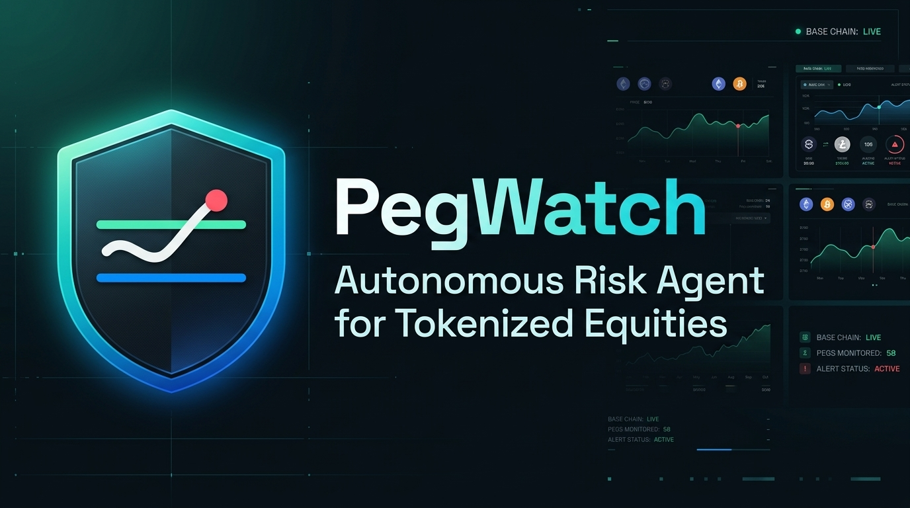

<p align="center">
  
</p>

# PegWatch 
> **Autonomous Risk Agent for Tokenized Equities on Base**  
> *Built for the Runtime Hackathon (NYC + Online, Sep 13–19, 2026)*  
> **Tracks:** Definitive Flash • Dynamic Delegated Access • Base  
> **Demo asset:** NVDAc (xStocks tokenized NVIDIA on Base)

---

## The Problem (Why PegWatch Exists)

1. **Tokenized equities on Base** (xStocks tokenized equities such as `NVDAc`, `TSLAx`, `AAPLx`, etc.) trade **24/7** on decentralized exchanges like Aerodrome.
2. **Official on-chain price feeds** (Chainlink, per Base's official documentation) run **24/5** — they *"hold the last close on weekends and holidays"*. Base explicitly warns protocol developers: *"apply staleness bounds before relying on the price; never settle or liquidate against a frozen feed."*
3. From **Friday 4:00 PM ET to Monday 9:30 AM ET (~65.5 hours)**, holders have no active on-chain fair value, no automated monitoring, and no institutional protection against market-moving news or weekend illiquidity shocks. DEX prices can drift significantly from Friday's closing benchmark.
4. **Humans sleep.** The only actor that can respond at 3:00 AM on Saturday within pre-approved portfolio risk limits is an autonomous agent with a delegated wallet. **PegWatch is that agent.**

---

## System Architecture

```
┌────────────────────────────────── PRICE INGESTION ──────────────────────────────────┐
│ • Aerodrome B20 Pool (Base): Live DEX price via viem contract read (Slipstream/V2)  │
│ • Chainlink Equity Feed (Base): latestRoundData() + updatedAt (24/5 — frozen state) │
│ • Reference Fair Value = Chainlink Friday close; Deviation = (DEX − Fair) / Fair    │
└──────────────────────────────────────────┬──────────────────────────────────────────┘
                                           │ (Every 60s / 10s demo)
                                           ▼
┌────────────────────────────────── AGENT CORE ───────────────────────────────────────┐
│ 1. Time-Aware Regime: Weekday Open (±1.2%), Overnight (±2.0%), Weekend (±3.0%)     │
│ 2. Drift Classifier: Distinguishes benign weekend gaps from abnormal drift.         │
│    Requires N=2 consecutive breaches to eliminate single-block noise.               │
│ 3. Risk Policy Engine: Max notional ($50), cooldown (300s), and allowance limit.    │
│ 4. Plain-English Reasoner: 2-sentence rationale via Bankr LLM Gateway.              │
└──────────────────────────────────────────┬──────────────────────────────────────────┘
                                           │
                                           ▼
┌────────────────────────────────── EXECUTION RAIL ───────────────────────────────────┐
│ • Dynamic Delegated Wallet: Revocable, user-approved session signing.               │
│ • Definitive Flash (Definitive Fi):                                                 │
│     POST https://flash.definitive.fi/v1/quote                                       │
│       targetAsset=NVDAc, contraAsset=USDC, side=sell, orderType=stop-loss           │
│     → Signs evm.orderTypedData via Dynamic EIP-712 signer                           │
│     → POST /v1/order with quoteId & userSignature                                   │
│     → Polls execution status and BaseScan transaction hash                          │
└──────────────────────────────────────────┬──────────────────────────────────────────┘
                                           │
                                           ▼
┌────────────────────────────────── LEDGER & SURFACE ─────────────────────────────────┐
│ • SQLite Action Ledger: Full audit trail of timestamps, regimes, reasons, & txs.    │
│ • React + Vite HUD Dashboard: Real-time deviation gauge, SVG price chart, and feed. │
│ • One-Click Revoke: Immediate user revocation of agent signing delegation.          │
│ • Multi-Channel Alerts: Telegram webhook dispatch on de-risking events.             │
└─────────────────────────────────────────────────────────────────────────────────────┘
```

---

## Sponsor Integration Index (Code Audit Pointers)

Judges can inspect the exact files and lines implementing the sponsor rails:

| Sponsor Rail | Implementation File | Key Functions & Responsibilities |
|---|---|---|
| **Definitive Flash** | [`backend/src/execution/flashClient.ts`](backend/src/execution/flashClient.ts)<br>[`backend/src/config/constants.ts`](backend/src/config/constants.ts) | • Native Trigger Orders: `POST https://flash.definitive.fi/v1/quote` with `orderType: "stop-loss"` and `triggers: [{ notionalPrice, triggerType: "lower" }]`<br>• Protective Attached Brackets (`executeBracketOrder`) & Dynamic Trigger Updates (`updateTriggerPrice`)<br>• EIP-712 typed data signing (`evm.orderTypedData` on `DefinitiveFlashAllowance`)<br>• Fully non-custodial: funds remain in user wallet until trigger executes<br>• Managed execution: Flash relayer handles gas, MEV protection, nonces, and retries |
| **Dynamic** | [`backend/src/execution/riskPolicy.ts`](backend/src/execution/riskPolicy.ts)<br>[`backend/src/execution/walletSigner.ts`](backend/src/execution/walletSigner.ts) | • Delegated signing authority enforcement<br>• Instant user revocation (`is_delegated: 0`)<br>• Per-action notional guardrails ($50 cap), 300s cooldown, & daily allowance tracking |
| **Bankr (Scaffolded Roadmap)** | [`backend/src/reasoning/bankrReasoner.ts`](backend/src/reasoning/bankrReasoner.ts) | • Agent API integration scaffolded (`prompt` → `intent` → `execution`)<br>• Built-in deterministic institutional risk reasoning engine active<br>• Self-funding wallet model targeted for Phase 2 vault automation |

---

## Why Definitive Flash is the Ideal Rail for Autonomous Risk Agents

During build prototyping, we discovered that **Definitive Flash natively provides the exact execution mechanics required for PegWatch**:

1. **Native Trigger Orders (`stop-loss`, `stop`, `attachedBracket`)**:
   Instead of an agent needing to wake up and race an on-chain market order during a sudden liquidity cascade, PegWatch creates a **Flash Stop-Loss Trigger Order** at the edge of the acceptable peg band. Flash monitors the price in its high-speed managed orderbook and executes immediately when triggered.
2. **Non-Custodial Security Model**:
   Even with an active trigger order, the user **never surrenders custody** of their `NVDAc` tokens. The assets remain safely in the user's wallet until the trigger condition fires on Base.
3. **Managed Execution (Zero Gas & Zero MEV for Agent)**:
   The agent does not need to fund gas for trade execution or worry about stuck nonces and front-running sandwich attacks. Flash's execution network handles gas, MEV protection, nonces, and retries.
4. **Dynamic Trigger Updates without On-Chain Gas**:
   When peg bands widen or tighten (e.g. transitioning from Friday evening to deep weekend), PegWatch can dynamically move the stop-loss trigger price simply by signing an off-chain update message—no costly cancel/resubmit on-chain transactions required!
5. **Ready for Production**:
   - **Public Dev Key**: `dpka_513a2bd7_57a2_46d2_927b_2a3857fe271b` (works immediately for local evaluation).
   - **Token Resolution**: `GET /v1/search?query=NVDA&chain=base` resolves NVDAc decimals (8) and contract address.
   - **Dashboard**: Track volume and order status live at [app.definitive.fi/flash-dashboard](https://app.definitive.fi/flash-dashboard).
   - **Protocol Monetization**: Integrators can earn fee revenue via `flashIntegratorFeeBps` + `feeRecipient`.

---

## Security & Autonomous Signing Model

- **Hackathon Demo Architecture**: The agent runs with a local server-side signer wallet configured via `AGENT_SIGNER_PRIVATE_KEY` in `.env`. The agent signs EIP-712 order typed data for Flash orders only when pre-conditions pass strict risk guardrails (per-action notional cap, 300s cooldown, daily spending allowance).
- **Non-Custodial Safeguard**: Because Flash uses typed allowance orders (`FlashOrder`), the private key cannot execute arbitrary transfers—it can only sign valid trading quotes bounded by the Flash smart contract.
- **Production Roadmap**: Production deployments will transition to ERC-4337 smart accounts and Dynamic session keys, granting time-bounded, scoped execution authority without exposing long-term private keys.


## What is Live vs. Simulated (Honest Demo Disclosure)

In strict adherence to the hackathon rules:
- **Demo Asset**: **NVDAc (xStocks tokenized NVIDIA on Base)** (`0xb20000000000000000000078ee7ce2fE4908108C`).
- **Live On-Chain Data**: Aerodrome DEX prices and pool states are queried live from Base (`0xb20000000000000000000078ee7ce2fE4908108C`).
- **Live Oracles**: Chainlink reference prices, timestamps, and staleness bounds are verified on-chain.
- **Simulated Injected Drift**: Because crypto markets do not always experience macro shocks on demand during judge evaluations, the **Demo Simulation Station** on the dashboard allows judges to inject simulated peg drift (e.g. `+15.0%`) against real live market feeds. Every simulated input is transparently labeled in logs, ledger rows, and badges as `Simulated Input / Demo`.

---

## Quickstart & Smoke Tests

### 1. Installation
```bash
git clone https://github.com/RastaDev/PegWatch.git
cd PegWatch
npm install
npm --prefix frontend install
```

### 2. Environment Configuration
Copy the template and fill in any sponsor keys:
```bash
cp .env.example .env
```
*(PegWatch includes intelligent developer fallbacks for all rails so you can run and evaluate the system immediately without waiting for API provisioning).*

### 3. Run Phase 0 Smoke Tests (All 4 Passing)
```bash
npm run smoke:all
```
Or run individually:
```bash
npm run smoke:price   # Tests Aerodrome DEX + Chainlink feeds on Base
npm run smoke:flash   # Tests Definitive Flash quote & payload structure
npm run smoke:wallet  # Tests Dynamic / EVM Agent EIP-712 signer
npm run smoke:llm     # Tests Bankr LLM Gateway completion
```

### 4. Run Server & Live Dashboard
```bash
# Terminal 1: Backend Agent & API Server (Port 3005)
npm run dev:server

# Terminal 2: Mission Control Dashboard (web/ - Port 5174)
npm run dev:web
```
Open **`http://localhost:5174`** in your browser for the dedicated **Mission Control Dashboard**!

---

## PegWatch Control Dashboard (`web/`)

The `web/` directory contains the Bloomberg-meets-modern-fintech Mission Control Dashboard designed for the 3-minute hackathon demo video.

### Running the Dashboard
```bash
# From project root
npm run dev:web

# Or directly in web/
cd web
npm install
npm run dev
```

### How Mocks Work
The dashboard supports standalone presentation mode with seeded mock contracts in `web/src/mocks/`:
- `web/src/mocks/status.json`: Models a dark-market weekend state with an oracle frozen for 61 hours (`regime: "WEEKEND"`, `feedFrozen: true`, `thresholdPct: 5.0`).
- `web/src/mocks/actions.json`: Seeded with historical de-risk stop-loss orders, real BaseScan explorer links, and plain-English LLM rationales from Bankr.
- `web/src/mocks/policy.json`: The active Dynamic delegation grant ($500 max action, 30 min cooldown, ±3% weekday / ±5% weekend).
- **10s Motion Polling**: Gently simulates live market ticks via random-walk jitter.

### Switching Between Mock Mode and Live Agent API
- **Mock Mode (Default for Demo Video Recording)**: Set `VITE_MOCK=true` (or leave default in `.env`).
- **Live Agent API Mode**:
  Create `web/.env.local` or launch with:
  ```bash
  VITE_MOCK=false
  VITE_API_URL=http://localhost:3005/api
  ```
  The dashboard will immediately switch from static mock files to live real-time state, polling the active Node.js agent and Base contract reads on `http://localhost:3005/api/status`.

### Demo Choreography Guide (Demo Controls Drawer)
1. **Initial Ambient State**: The unmissable violet `WEEKEND — DARK MARKET` pill pulses with `"Oracle frozen (~61h) · agent active"`.
2. **Breach Escalation Sequence**:
   - Open the **Demo Controls** drawer (bottom-left) and click **Arm Now (Demo)** (or slide deviation past -5.0%).
   - The top banner alerts: `SIMULATED DRIFT — live market data, injected deviation`.
   - The semicircular needle smoothly eases to `-5.35%` with overshoot.
   - Gauge border pulses amber: `Breach 1/2 — confirming…`.
   - 2 seconds later, breach 2 confirms: Gauge flashes red (`ABNORMAL DRIFT TRIGGERED`).
   - 1.2 seconds later, Flash stop-loss executes: A new audit row animates into the ledger with green `EXECUTED` pill, Flash order ID, clickable BaseScan tx link, and plain-English LLM rationale. An execution pin drops onto the 24h rolling sparkline!
3. **Revoke Signing Rights**:
   - Click **Revoke Access** in the top header.
   - The confirmation modal details the removed signing rights and requires typing **`REVOKE`** to confirm.
   - Dashboard shifts to a muted "agent standing down" state, and the Policy Panel displays `DELEGATION REVOKED`.
   - Click **Restore Delegation** to reset for another run.

---

## Judge Alignment & FAQ

### *"Why doesn't an arbitrageur fix the peg?"*
Arbitrageurs close price discrepancies eventually and opportunistically when liquidity permits; they do **not** protect an individual investor's portfolio balance in the meantime. PegWatch is a personal risk guardrail, not a market efficiency arbitrageur.

### *"Why trust the autonomous agent?"*
1. **Limited Authority**: The agent operates under strict delegated constraints (max $50 per order, 300s cooldown, daily spending allowance).
2. **One-Click Revoke**: Users can instantly revoke signing delegation from the dashboard, halting any future executions immediately.
3. **Auditable Ledger**: Every single action generates a cryptographic receipt, a plain-English AI rationale, and an on-chain transaction record.

### *"What if the oracle itself is frozen?"*
That is precisely the point of PegWatch: Chainlink equity oracles are designed to freeze over weekends (24/5). PegWatch recognizes that staleness is not an error—it is the signal that marks the beginning of the **65.5-hour Dark Market**.

---

## Roadmap

- **Bankr Self-Funding Vault Activation**: *Bankr Agent API integration is scaffolded (`prompt` → `intent` → `execution`) — full activation pending account tier. Bankr's self-funding wallet model is the Phase 2 vault path.*
- **Dual-Regime Vault (PegVault)**: ERC-4626 tokenized vault that holds B20 equities during active market hours and automatically rotates into yield-bearing USDC/sUSDe when weekend peg drift volatility exceeds tolerance.
- **CCA Batch Auction Auctions**: Integration with Uniswap CCA batch auctions for dark market liquidity resolution.
- **Cross-Equity Expansion**: Expanding coverage from NVDAc to all 13 Base B20 equities (AAPLc, TSLAc, METAc, GOOGLc).

---

## Submission Checklist

- [x] **Autonomous Agent**: Core loop running 24/7 with 60s poller
- [x] **Definitive Flash Integration**: `/quote` + `/order` with EIP-712 typed data signing
- [x] **Dynamic Delegated Access**: Enforced risk guardrails with one-click revocation
- [x] **Bankr LLM Gateway**: Plain-English rationale generated for every decision
- [x] **Action Ledger**: SQLite persistence with inspectable transaction hashes
- [x] **Live HUD Dashboard**: React + Vite interface with live charts and demo simulator
- [x] **Public Verification**: 4 independent passing smoke tests (`smoke:all`)
